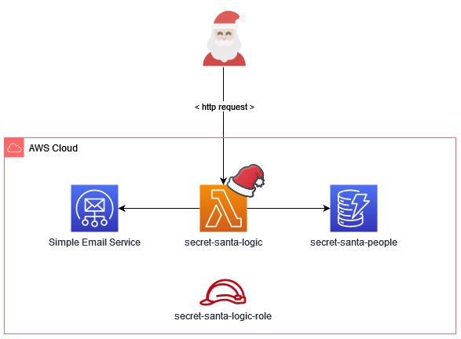

# Serverless Secret Santa 🎅
A story about how Serverless saved the Christmas ✨

This repository references a Medium Article that you can read [HERE](https://medium.com/@salvatorecirone/build-a-secret-santa-on-aws-aa47cac1a7ad)

<br>
<br>
<br>

## AWS Architecture



## Deploy the SAM template

### Prerequisites

- An AWS Account to deploy the infrastructure
- [AWS CLI v2](https://docs.aws.amazon.com/cli/latest/userguide/getting-started-install.html)
- [SAM CLI](https://aws.amazon.com/serverless/sam/)

### How to
Once you have everything listed above, you will need to configure the AWS CLI tool to access your AWS account.

Then, open the [`aws/samconfig.toml`](https://github.com/akaSomix/serverless-secret-santa/blob/main/aws/samconfig.toml) file and change
the following part:
```
parameter_overrides = [
    "SenderEmail=\"youremail@example.com\"",
]
```
Putting the email you have verified on the AWS SES that you want to use to send the secret santa invites.

Then change directory to aws:
```
cd aws/
```

and run the following:
```
sam deploy
```
This should automatically take all the configurations from the `samconfig.toml` file and deploy your infrastructure.

### Tear down
When you have finished, you can go again in the `aws/` folder and run

```
sam delete
```
to tear down the whole project

